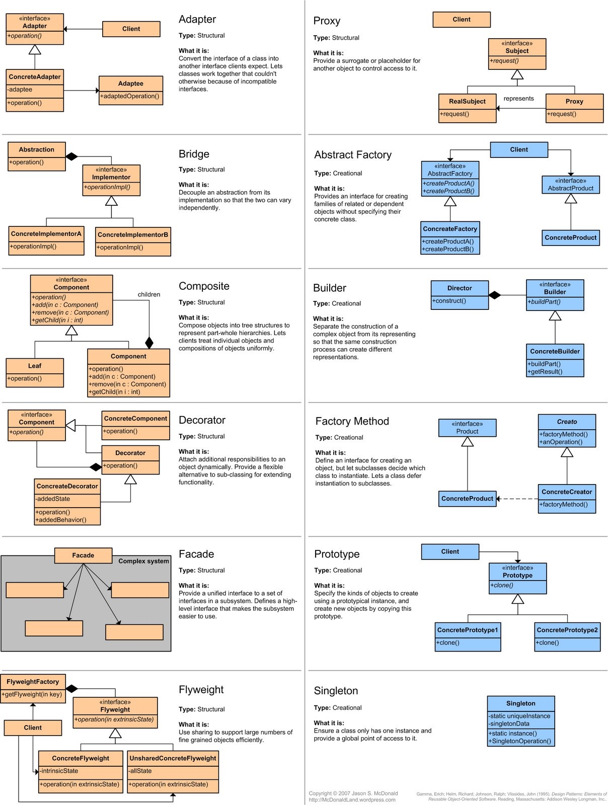

# Facade Design Pattern 

Welcome! This repo is just for a small project to demonstrate to myself how a facade pattern works in programming. I've recently been learning about design patterns and programming and found that the facade pattern was a good pattern to start with, simply because the concept is very easy to understand when it comes to front-end developing!

## Datamuse API
In this project I used the Datamuse API[https://api.datamuse.com/] to make a request and retrieve a list of synonyms of a given word by the user. To make the request I made a class to fetch the data and inside the class is the business logic to actually request and retrieve that data. I then made a second class which represents the facade pattern. The class takes in the get SynonymGetter class as an argument and displays that data to the user. 

Now whenever we need to display the synonyms we can just call a new instance of those classes, pass in the SynonymGetter that makes the request then pass that into the facade class as an argument! This prevents us from constantly rewriting the fetch method everytime we want to display the synonyms. 

Furthermore, if we were to use a different API or a new service altogether, instead of refactoring the files that depended on that API or service, we can just modify the facade file to accomodate for the new API or service. This improves the readability and flexibility of the project!